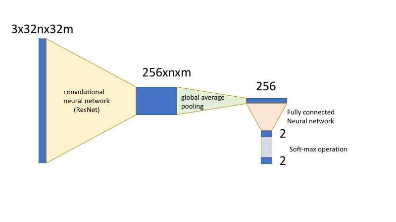

# DNN_Classify

This is my study on the classifier based on deep convolutional neural network.


## Capturing training data from a web camera

```
python3 cap_video.py
```

* press number key (e.g., 1, 2) to store what is shown in the web camera to the training images.


## Training

```
python3 dnn_train.py
```


## Evaluating the classifier

```
python3 eval_video.py
```


## Implementation

We implement the neural network using the PyTorch. The network archtecture is based on the ResNet. The ResNet convert the RGB input image into 256 dimensional feature vector while shrinking its height and width by 1/32. Then, we apply the global average poolling to convert the 256 dimentional feature map into a 256 feacture vector. After that, we apply fully connected convolution operations and finally, we computer the probablity by the soft-max operation.


